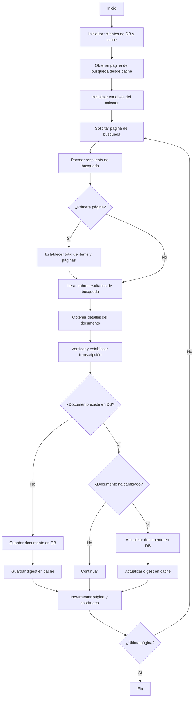
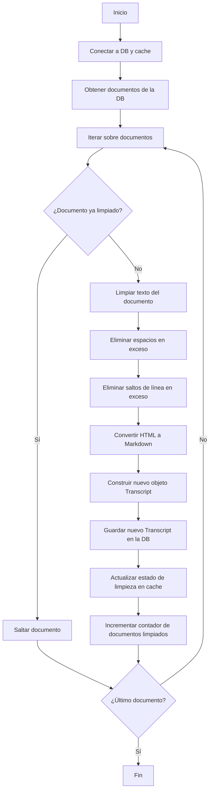

# Proyecto de Extracción y Estandarización de Transcripciones de la SCJN

Este proyecto tiene como objetivo la creación de un corpus de transcripciones estenográficas de las sesiones de la Suprema Corte de Justicia de la Nación (SCJN), con el fin de facilitar su análisis y exploración.

- [1. Descripción](#1-descripción)
- [2. Instalación](#2-instalación)
  - [2.1. Configuración de bases de datos](#21-configuración-de-bases-de-datos)
- [3. Uso](#3-uso)
  - [3.1. Recolección de transcripciones](#31-recolección-de-transcripciones)
  - [3.2. Limpieza de transcripciones](#32-limpieza-de-transcripciones)
  - [3.3. Generación de archivos](#33-generación-de-archivos)
- [4. Detalles técnicos](#4-detalles-técnicos)
  - [4.1. Extracción](#41-extracción)
  - [4.2. Limpieza](#42-limpieza)
- [5. Estado del Proyecto](#5-estado-del-proyecto)
- [6. Contribuciones](#6-contribuciones)
- [7. Licencia](#7-licencia)

## 1. Descripción

El proyecto tiene como objetivo principal la creación de un corpus de transcripciones estenográficas de las sesiones de la SCJN. Este repositorio contiene el código necesario para la extracción, limpieza y estandarización de las transcripciones.

El proyecto implementa las siguientes características:
1. Extracción de transcripciones de la SCJN: Se extraen las transcripciones de las sesiones de la SCJN usando la API del buscador jurídico de la SCJN.
2. Limpieza de transcripciones: Su contenido se almacena en texto plano, usando Markdown para facilitar su lectura y análisis.

## 2. Instalación

Para instalar este paquete desde el repositorio, puedes usar el siguiente comando:

```bash
pip install git+https://github.com/pablorm296/scjn-transcripts.git
```

### 2.1. Configuración de bases de datos

El proyecto utiliza una base de datos MongoDB para almacenar las transcripciones y una base de datos Redis como caché para saber qué documentos ya han sido procesados y poder recuperar el ciclo de extracción en caso de un error inesperado.

Para configurar la conexión a las bases de datos, el proyecto usa un archivo `.env.local`. Puedes encontrar un ejemplo de este archivo en `.env.example`.

Si deseas usar una base de datos local, se incluye un archivo `docker-compose.yml` para configurarlo. Puedes iniciar los servicios de MongoDB y Redis con el siguiente comando:

```bash
docker-compose up -d
```

Asegúrate de configurar las variables de entorno en tu archivo `.env.local` para que apunten a las instancias locales de MongoDB y Redis.

## 3. Uso

Este proyecto proporciona una interfaz de línea de comandos (CLI) para facilitar la recolección, limpieza y generación de archivos de transcripciones. Puedes acceder a la interfaz de línea de comandos ejecutando el comando `transcripts` en tu terminal.

Para obtener una lista de comandos disponibles, simplement usa la opción `--help`:

```bash
transcripts --help
```

### 3.1. Recolección de transcripciones

Para iniciar el proceso de recolección (_scrapping_) de transcripciones, puedes utilizar el comando `collect` proporcionado por la interfaz de línea de comandos (CLI). A continuación se muestra un ejemplo de cómo usar este comando:

```bash
transcripts collect --verbose --ignore-page-cache
```

Opciones disponibles:
- `--verbose` o `-v`: Aumenta la verbosidad del registro para obtener más detalles durante la ejecución.
- `--ignore-page-cache` o `-i`: Ignora la caché de la última página solicitada y comienza desde la primera página.

### 3.2. Limpieza de transcripciones

Para iniciar el proceso de limpieza de transcripciones, puedes utilizar el comando `clean` proporcionado por la interfaz de línea de comandos (CLI). A continuación se muestra un ejemplo de cómo usar este comando:

```bash
transcripts clean --verbose
```

Opciones disponibles:
- `--verbose` o `-v`: Aumenta la verbosidad del registro para obtener más detalles durante la ejecución.

### 3.3. Generación de archivos

Para iniciar el proceso de generación de archivos de transcripciones, puedes utilizar el comando `dump` proporcionado por la interfaz de línea de comandos (CLI). A continuación se muestra un ejemplo de cómo usar este comando:

```bash
transcripts dump /ruta/a/directorio --verbose
```

Opciones disponibles:
- `--verbose` o `-v`: Aumenta la verbosidad del registro para obtener más detalles durante la ejecución.

Los documentos generados incluyen un frontmatter (delimitado por tres guiones medios al inicio del documento) con metadata relevante de la transcripción, como se muestra a continuación:

```markdown
---
title: "Título de la Transcripción"
date: "Fecha de la Transcripción"
session: "Número de Sesión"
---
Contenido de la transcripción...
```

## 4. Detalles técnicos

### 4.1. Extracción

El proceso de extracción de las versiones estenográficas de la SCJN se implementa en `scjn_transcripts.collector.transcripts`, específicamente en `ScjnSTranscriptsCollector.collect`. A continuación se presenta un diagrama de flujo que detalla el algoritmo de descarga de los documentos:



### 4.2. Limpieza

El proceso de limpieza de las transcripciones se implementa en `scjn_transcripts.cleaner.transcripts`, específicamente en `ScjnSTranscriptsCleaner.clean`. A continuación se presenta un diagrama de flujo que detalla el algoritmo de limpieza de los textos:



## 5. Estado del Proyecto
Este es un trabajo en progreso. Se están desarrollando y probando diferentes estrategias para optimizar la calidad de los datos procesados. Conforme se agreguen nuevas características y mejoras, este README será actualizado.

## 6. Contribuciones
Por el momento, el proyecto es de uso personal, pero en el futuro podrían abrirse oportunidades para contribuciones externas.

## 7. Licencia
Por definir.
