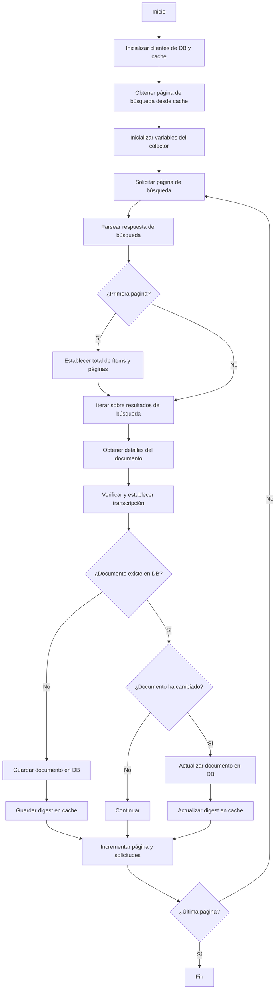

# Proyecto de Extracción y Estandarización de Transcripciones de la SCJN

Este proyecto tiene como objetivo la creación de un corpus de transcripciones estenográficas de las sesiones de la Suprema Corte de Justicia de la Nación (SCJN), con el fin de facilitar su análisis y exploración.

- [1. Descripción](#1-descripción)
- [2. Instalación](#2-instalación)
- [3. Uso](#3-uso)
  - [3.1. Infraestructura local](#31-infraestructura-local)
- [4. Detalles técnicos](#4-detalles-técnicos)
  - [4.1. Extracción](#41-extracción)
- [5. Estado del Proyecto](#5-estado-del-proyecto)
- [6. Contribuciones](#6-contribuciones)
- [7. Licencia](#7-licencia)

## 1. Descripción

El proyecto tiene como objetivo principal la creación de un corpus de transcripciones estenográficas de las sesiones de la SCJN. Este repositorio contiene el código necesario para la extracción, limpieza y estandarización de las transcripciones.

El proyecto implementa las siguientes características:
1. Extracción de transcripciones de la SCJN: Se extraen las transcripciones de las sesiones de la SCJN usando la API del buscador jurídico de la SCJN.
2. Limpieza de transcripciones: Su contenido se almacena en texto plano, usando Markdown para facilitar su lectura y análisis.

## 2. Instalación

## 3. Uso

### 3.1. Infraestructura local

## 4. Detalles técnicos

### 4.1. Extracción

El proceso de extracción de las versiones estenográficas de la SCJN se implementa en `scjn_transcripts.collector.transcripts`, específicamente en `ScjnSTranscriptsCollector.collect`. A continuación se presenta un diagrama de flujo que detalla el algoritmo de descarga de los documentos:

## 5. Estado del Proyecto
Este es un trabajo en progreso. Se están desarrollando y probando diferentes estrategias para optimizar la calidad de los datos procesados. Conforme se agreguen nuevas características y mejoras, este README será actualizado.

## 6. Contribuciones
Por el momento, el proyecto es de uso personal, pero en el futuro podrían abrirse oportunidades para contribuciones externas.

## 7. Licencia
Por definir.
