# Proyecto de Extracción y Estandarización de Transcripciones de la SCJN

Este proyecto tiene como objetivo la creación de un corpus de transcripciones estenográficas de las sesiones de la Suprema Corte de Justicia de la Nación (SCJN), con el fin de facilitar su análisis y exploración.

- [1. Descripción](#1-descripción)
- [2. Instalación](#2-instalación)
  - [2.1. Configuración de bases de datos](#21-configuración-de-bases-de-datos)
- [3. Uso](#3-uso)
  - [3.1. Recolección de transcripciones](#31-recolección-de-transcripciones)
  - [3.2. Limpieza de transcripciones](#32-limpieza-de-transcripciones)
  - [3.3. Generación de archivos](#33-generación-de-archivos)
- [4. Detalles técnicos](#4-detalles-técnicos)
  - [4.1. Extracción](#41-extracción)
  - [4.2. Limpieza](#42-limpieza)
- [5. Estado del Proyecto](#5-estado-del-proyecto)
  - [Implementadas](#implementadas)
  - [Por implementar](#por-implementar)
- [6. Contribuciones](#6-contribuciones)
- [7. Licencia](#7-licencia)

## 1. Descripción

El proyecto tiene como objetivo principal la creación de un corpus de transcripciones estenográficas de las sesiones de la SCJN. Este repositorio contiene el código necesario para la extracción, limpieza y estandarización de las transcripciones.

El proyecto implementa las siguientes características:
1. Extracción de transcripciones de la SCJN: Se extraen las transcripciones de las sesiones de la SCJN usando la API del buscador jurídico de la SCJN.
2. Limpieza de transcripciones: Su contenido se almacena en texto plano, usando Markdown para facilitar su lectura y análisis.

## 2. Instalación

Primero, clona el repositorio en tu máquina local:

```bash
git clone https://github.com/pablorm296/scjn-transcripts.git
cd scjn-transcripts
```

Luego, instala el proyecto y sus dependencias usando pip:

```bash
pip install .
```

### 2.1. Configuración de bases de datos

El proyecto utiliza una base de datos MongoDB para almacenar las transcripciones y una base de datos Redis como caché para saber qué documentos ya han sido procesados y poder recuperar el ciclo de extracción en caso de un error inesperado.

Primero, copia el contenido del archivo `.env.example` a un nuevo archivo llamado `.env.local`:

```bash
cp .env.example .env.local
```

Edita el archivo `.env.local` para configurar los secretos del proyecto según tus necesidades.

Para configurar las instancias de MongoDB y Redis usando Docker, utiliza los archivos de ejemplo proporcionados. Copia el contenido del archivo `docker/mongo/scripts/init.example.js` a un nuevo archivo llamado `init.js` en el mismo directorio:

```bash
cp docker/mongo/scripts/init.example.js docker/mongo/scripts/init.js
```

Haz lo mismo con el archivo de configuración de Redis:

```bash
cp docker/redis/redis.conf.example docker/redis/redis.conf
```

Luego, levanta los servicios de MongoDB y Redis usando Docker Compose:

```bash
docker-compose up -d
```

Asegúrate de configurar las variables de entorno en tu archivo `.env.local` para que apunten a las instancias locales de MongoDB y Redis.

## 3. Uso

Este proyecto proporciona una interfaz de línea de comandos (CLI) para facilitar la recolección, limpieza y generación de archivos de transcripciones. Puedes acceder a la interfaz de línea de comandos ejecutando el comando `transcripts` en tu terminal.

Para obtener una lista de comandos disponibles, simplement usa la opción `--help`:

```bash
transcripts --help
```

### 3.1. Recolección de transcripciones

Para iniciar el proceso de recolección (_scrapping_) de transcripciones, puedes utilizar el comando `collect` proporcionado por la interfaz de línea de comandos (CLI). A continuación se muestra un ejemplo de cómo usar este comando:

```bash
transcripts collect --verbose --ignore-page-cache
```

Opciones disponibles:
- `--verbose` o `-v`: Aumenta la verbosidad del registro para obtener más detalles durante la ejecución.
- `--ignore-page-cache` o `-i`: Ignora la caché de la última página solicitada y comienza desde la primera página.

### 3.2. Limpieza de transcripciones

Para iniciar el proceso de limpieza de transcripciones, puedes utilizar el comando `clean` proporcionado por la interfaz de línea de comandos (CLI). A continuación se muestra un ejemplo de cómo usar este comando:

```bash
transcripts clean --verbose
```

Opciones disponibles:
- `--verbose` o `-v`: Aumenta la verbosidad del registro para obtener más detalles durante la ejecución.

### 3.3. Generación de archivos

Para iniciar el proceso de generación de archivos de transcripciones, puedes utilizar el comando `dump` proporcionado por la interfaz de línea de comandos (CLI). A continuación se muestra un ejemplo de cómo usar este comando:

```bash
transcripts dump /ruta/a/directorio --verbose
```

Opciones disponibles:
- `--verbose` o `-v`: Aumenta la verbosidad del registro para obtener más detalles durante la ejecución.

Los documentos generados incluyen un frontmatter (delimitado por tres guiones medios al inicio del documento) con metadata relevante de la transcripción, como se muestra a continuación:

```markdown
---
id: id del documento
organo_jurisdiccional: pleno o sala
url_video: url del vídeo de la sesión
url_documento: url del PDF de la transcripción
asuntos: lista de los asuntos tratados en la sesión
fecha_sesión: fecha de la sesión
---
Contenido de la transcripción...
```

## 4. Detalles técnicos

### 4.1. Extracción

El proceso de extracción de las versiones estenográficas de la SCJN se implementa en `scjn_transcripts.collector.transcripts`, específicamente en `ScjnSTranscriptsCollector.collect`. A continuación se presenta un diagrama de flujo que detalla el algoritmo de descarga de los documentos:

```mermaid
graph TD
    A[Inicio] --> B[Inicializar clientes de DB y cache]
    B --> C[Obtener página de búsqueda desde cache]
    C --> D[Inicializar variables del colector]
    D --> E[Solicitar página de búsqueda]
    E --> F[Parsear respuesta de búsqueda]
    F --> G{¿Primera página?}
    G -- Sí --> H[Establecer total de ítems y páginas]
    H --> I[Iterar sobre resultados de búsqueda]
    G -- No --> I[Iterar sobre resultados de búsqueda]
    I --> J[Obtener detalles del documento]
    J --> K[Verificar y establecer transcripción]
    K --> L{¿Documento existe en DB?}
    L -- No --> M[Guardar documento en DB]
    M --> N[Guardar digest en cache]
    N --> S[Incrementar página y solicitudes]
    L -- Sí --> O{¿Documento ha cambiado?}
    O -- No --> P[Continuar]
    P --> S[Incrementar página y solicitudes]
    O -- Sí --> Q[Actualizar documento en DB]
    Q --> R[Actualizar digest en cache]
    R --> S[Incrementar página y solicitudes]
    S --> T{¿Última página?}
    T -- No --> E
    T -- Sí --> U[Fin]
```



### 4.2. Limpieza

El proceso de limpieza de las transcripciones se implementa en `scjn_transcripts.cleaner.transcripts`, específicamente en `ScjnSTranscriptsCleaner.clean`. A continuación se presenta un diagrama de flujo que detalla el algoritmo de limpieza de los textos:

```mermaid
graph TD
    A[Inicio] --> B[Conectar a DB y cache]
    B --> C[Obtener documentos de la DB]
    C --> D[Iterar sobre documentos]
    D --> E{¿Documento ya limpiado?}
    E -- Sí --> F[Saltar documento]
    E -- No --> G[Limpiar texto del documento]
    G --> H[Eliminar espacios en exceso]
    H --> I[Eliminar saltos de línea en exceso]
    I --> J[Convertir HTML a Markdown]
    J --> K[Construir nuevo objeto Transcript]
    K --> L[Guardar nuevo Transcript en la DB]
    L --> M[Actualizar estado de limpieza en cache]
    M --> N[Incrementar contador de documentos limpiados]
    F --> O{¿Último documento?}
    N --> O
    O -- No --> D
    O -- Sí --> P[Fin]
```



## 5. Estado del Proyecto

Este es un trabajo en progreso. A continuación se listan las características del proyecto:

### Implementadas
- [x] 🕵️‍♂️ **Scrapping de transcripciones a partir del buscador jurídico de la SCJN**: Se extraen las transcripciones de las sesiones de la SCJN usando la API del buscador jurídico.
- [x] 💾 **Almacenamiento de las transcripciones en una base de datos**: Las transcripciones se almacenan en una base de datos MongoDB.
- [x] 🧹 **Limpieza de transcripciones en base de datos**: Se limpian las transcripciones almacenadas en la base de datos para facilitar su análisis.
- [x] 📄 **Generación de archivos a partir del contenido de la base de datos**: Se generan archivos de transcripciones en formato Markdown a partir de los datos almacenados.

### Por implementar
- [ ] 📥 **Población de la base de datos a partir de archivos markdown**: Permitir la carga de transcripciones en la base de datos a partir de archivos Markdown existentes.
- [ ] 🤖 **RAG**: Implementar un sistema de generación de texto mejorada por recuperación para interactuar con las transcripciones.

Conforme se agreguen nuevas características y mejoras, este README será actualizado.

## 6. Contribuciones
Por el momento, el proyecto es de uso personal, pero en el futuro podrían abrirse oportunidades para contribuciones externas.

## 7. Licencia
Por definir.
